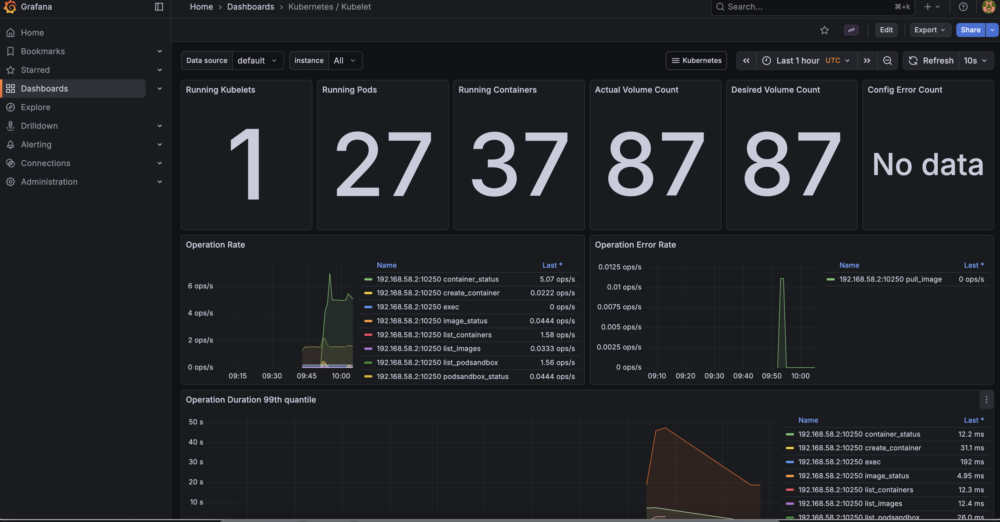

# Monitoring

ARK exposes Prometheus metrics from the controller. This guide covers setting up Prometheus and Grafana to monitor your ARK installation.

## Prerequisites

- Kubernetes cluster with ARK deployed
- Helm installed

## Install Prometheus stack

Install the kube-prometheus-stack which includes Prometheus, Grafana, and the ServiceMonitor CRD:

```bash
helm repo add prometheus-community https://prometheus-community.github.io/helm-charts
helm repo update

helm install prometheus prometheus-community/kube-prometheus-stack \
  --namespace monitoring --create-namespace \
  --set prometheus.prometheusSpec.serviceMonitorSelectorNilUsesHelmValues=false
```

The `serviceMonitorSelectorNilUsesHelmValues=false` setting allows Prometheus to discover ServiceMonitors in all namespaces.

## Verify metrics collection

Check that the ARK ServiceMonitor exists:

```bash
kubectl get servicemonitor -n ark-system
```

Port-forward to Prometheus and check the targets:

```bash
kubectl port-forward -n monitoring svc/prometheus-kube-prometheus-prometheus 9090:9090
```

Open http://localhost:9090/targets and verify ARK targets are being scraped.

## Access Grafana

Port-forward to Grafana:

```bash
kubectl port-forward -n monitoring svc/prometheus-grafana 3000:80
```

Open http://localhost:3000 and log in with:
- Username: `admin`
- Password: `prom-operator`



## TLS configuration

ARK uses cert-manager to secure metrics endpoints with TLS. The ServiceMonitor is configured to verify certificates rather than skip verification (`insecureSkipVerify: false`).

Ensure cert-manager is installed (included by default with `devspace dev`):

```bash
kubectl get pods -n cert-manager
```

## Available metrics

ARK exposes standard Kubernetes controller metrics including:
- Reconciliation counts and durations
- Work queue depth and latency
- Controller runtime metrics

Query these in Prometheus using the `controller_runtime_*` metric prefix.
